# Hackathon runbook (2 days)

> One linear path for a 2-day hackathon: **Day 1 stands up the infra**, **Day 2 builds the real
> application** on top with the spec2cloud (SDD) workflow. This page is the orchestration layer —
> it links to the authoritative specs rather than restating them. Read the linked sections; don't
> skip the prerequisites.

```mermaid
%%{init: {'theme':'base','themeVariables':{'primaryColor':'#E6F2FA','primaryTextColor':'#323130','primaryBorderColor':'#0078D4','secondaryColor':'#E6F2FA','secondaryTextColor':'#323130','secondaryBorderColor':'#0078D4','tertiaryColor':'#E6F2FA','tertiaryTextColor':'#323130','tertiaryBorderColor':'#0078D4','clusterBkg':'#E6F2FA','clusterBorder':'#0078D4','titleColor':'#323130','textColor':'#323130','edgeLabelBackground':'#ffffff','lineColor':'#005A9E','fontFamily':'Segoe UI'}}}%%
flowchart LR
    subgraph D1["Day 1 - infra"]
        P["Prereqs<br/><i>RBAC · quota · providers</i>"]
        U["azd up<br/><i>~10-20 min</i>"]
        S["Smoke test<br/><i>verify topology</i>"]
    end
    subgraph D2["Day 2 - build"]
        PRD["/prd → /frd"]
        PLAN["/plan"]
        IMPL["/implement"]
        DEP["/deploy"]
    end
    P --> U --> S --> PRD --> PLAN --> IMPL --> DEP

    classDef userNode fill:#005A9E,stroke:#004578,color:#fff
    classDef appNode fill:#0078D4,stroke:#004578,color:#fff
    classDef paasNode fill:#E6F2FA,stroke:#0078D4,color:#323130
    class P userNode
    class U,S,PRD,PLAN,IMPL,DEP appNode
```



## Before the day starts (do this the day before)

These are the things that **cannot be fixed in a coffee break** — sort them in advance.

1. **Model quota** — the #1 blocker. Confirm **≥10K TPM GlobalStandard** for `gpt-4o-mini` in your
   target region, or request an increase (can take hours/days). See
   [`specs/azure-deployment-requirements.md`](specs/azure-deployment-requirements.md) §A.5.
2. **Subscription RBAC** — you need **Owner**, *or* **Contributor + User Access Administrator** at
   subscription scope. Contributor alone **fails** (it can't create the role assignments). §A.2.
3. **Resource providers registered** — §A.3 (base) and §B.1/§B.2 (Cosmos + APIM).
4. **Region** — must offer Foundry + Container Apps + ACR + the model SKU (+ APIM + Storage). §A.6.

Full pre-flight checklist: [`specs/azure-deployment-requirements.md` → Quick checklist](specs/azure-deployment-requirements.md#quick-checklist).

## Day 1 — deploy the infra (~30–45 min incl. waits)

```bash
azd auth login
azd up        # ~10–20 min: Foundry account+project+model, ACA env + 3 apps, ACR, monitoring
```

Then verify end-to-end (ingress topology, streaming round-trip, isolation, model wiring):

```bash
pwsh ./infra/scripts/postdeploy-smoke-test.ps1     # non-Windows: install PowerShell 7 (pwsh) first
```

> **Expected:** a deployed turn returns the **offline echo stub**, not a model completion — model
> egress is fail-closed until you enable APIM (`AZURE_DEPLOY_APIM=true`). This is by design. See the
> README "Expected behavior" callout and §B.2. Decide as a team whether you need real model output in
> the cloud for your scenario (enable APIM) or whether the local real-model path is enough for Day 2.

**Prefer to let an agent drive it?** See the README "Deploy with GitHub Copilot" section — point an
agent at the deploy spec and it diagnoses quota/provider/policy blockers for you.

## Day 2 — build the app with spec2cloud (SDD)

No devcontainer required — every spec2cloud primitive is committed and read natively by your agent
harness. Pick a harness (GitHub Copilot CLI *or* VS Code + Copilot), then run the phases:

```text
/prd  →  /frd  →  /plan  →  /implement  →  /deploy
```

State is resumable in `.spec2cloud/state.json` (+ `audit.log`). Full instructions, harness setup,
and the optional MCP tool wiring are in the README ("Build the app with Spec2Cloud") and
[`Spec2Cloud-about.md`](Spec2Cloud-about.md). The target-state design you're filling in is the
[LLD](specs/lld-langgraph-foundry-agent.md).

**First moves once the pipeline is running:** replace the example route (`src/agentic-api/app.py`),
the example graph node (`src/orchestrator/graph.py` — wire `_generate` to a real model), and the
landing page (`src/agentic-ui/app/page.tsx`) with your domain.

## Troubleshooting — the failures teams actually hit

| Symptom | Likely cause | Fix |
|---|---|---|
| `azd up` fails with an **insufficient quota** error | <10K TPM GlobalStandard for the model in-region | Raise quota, or set `AZURE_AI_DEPLOYMENTS_LOCATION` to a region that has capacity — §A.5 |
| `azd up` fails creating **role assignments** (`RoleAssignmentUpdateNotPermitted` / authorization) | Deployer is **Contributor only** | Add **User Access Administrator**, or use an **Owner** principal — §A.2 |
| Provisioning fails: **resource type / provider not registered** | Provider not registered on the subscription | `az provider register --namespace <ns>` for the namespaces in §A.3 (and §B.1/§B.2) |
| Deploy fails: **`MissingSubscriptionRegistration` for `Microsoft.AlertsManagement`** | App Insights failure-anomalies alert rule needs this provider | The `preprovision` hook auto-registers it; if you still hit this, run `az provider register --namespace Microsoft.AlertsManagement --wait` then re-run — §A.3 |
| Container app revision fails: **`Operation expired` / `ContainerAppOperationError`** | First revision on a brand-new ACA environment timed out (often transient; placeholder image not yet serving the app's target port) | Re-run `azd provision` / `azd up` — the warm environment usually provisions the revision on retry |
| `azd up` fails creating a **user-assigned identity** | Azure Policy blocks `Microsoft.ManagedIdentity/userAssignedIdentities` | You're on the right branch — this `feature/system-assigned-identity` branch avoids UAMI. Don't switch to `main` in such tenants |
| **Cognitive Services / AI account** creation denied | Policy forces private networking / denies public Cognitive Services | Adjust the public-default Bicep first, or use a compliant subscription — §A.7 |
| Container image build/pull fails on **Docker Hub rate limit** (`toomanyrequests`) | A base image wasn't seeded into the project ACR | By default `postprovision` imports both base images from the **MCR mirror** (no Docker Hub, no login) — so this should not happen. If it does, re-run `azd provision` (re-runs the hook), or set a fallback source: `azd env set BASEIMAGE_FALLBACK_REGISTRY <registry>` (see "Base images" below) and re-provision |
| Deployed app **returns the echo stub**, never a real answer | Fail-closed model egress; APIM not enabled | Set `AZURE_DEPLOY_APIM=true` and grant APIM's identity the Cognitive Services roles — §B.2 |
| **Can't create Entra app registrations** for sign-in | No directory privilege | Use the **username/password gate** (`UI_AUTH_USERNAME` / `UI_AUTH_PASSWORD`) — no directory privilege needed — §A.9 |
| Smoke test: **`pwsh` not found** | PowerShell 7 not installed (Linux/macOS) | `winget/brew/apt install powershell`, then `pwsh ./infra/scripts/postdeploy-smoke-test.ps1` |
| Local app runs but **no model output** | `_generate` is an offline stub by design | Wire it to a deployment via `DefaultAzureCredential` (no keys) — LLD §5 / §C.3 |

## Base images (no Docker Hub login required)

Container images build **remotely in ACR** (`remoteBuild: true`) from base images that are first
imported into the **project ACR** by the `postprovision` hook. Both bases come from the
**Microsoft Artifact Registry (MCR) Docker mirror** — Microsoft-operated, no Docker Hub login, and
**not subject to Docker Hub's anonymous pull rate limit**:

| Base | Imported from | Tagged in ACR as |
|---|---|---|
| `python:3.11-slim` | `mcr.microsoft.com/mirror/docker/library/python:3.11-slim` | `python:3.11-slim` |
| `node:20-slim` | `mcr.microsoft.com/mirror/docker/library/node:20-bookworm-slim` | `node:20-slim` |

> `node:20-bookworm-slim` is the Debian image Docker Hub's `node:20-slim` currently aliases, so it is
> a drop-in. **Result: the deploy never touches Docker Hub** — you do *not* need to pre-stage your
> own registry. (The `FROM` defaults in `src/*/Dockerfile` still reference Docker Hub for a *plain
> local* `docker build`; `azd` overrides them to the ACR copy via `azure.yaml` buildArgs.)

**Break-glass (only if a primary import ever fails).** Point the hook at any registry you control —
e.g. an ACR that already holds the images — without editing files:

```bash
azd env set BASEIMAGE_FALLBACK_REGISTRY myacr.azurecr.io        # source: <registry>/<image>
# authenticated source (omit for an anonymous-pull ACR):
azd env set BASEIMAGE_FALLBACK_USERNAME <token-name>
azd env set BASEIMAGE_FALLBACK_PASSWORD <token-password>
azd provision                                                   # re-runs the import hook
```

The fallback fires **only** when the MCR import fails, so it is a safety net, not a dependency. To
pre-seed an ACR for it: `az acr import --name myacr --source mcr.microsoft.com/mirror/docker/library/node:20-bookworm-slim --image node:20-slim` (and the python equivalent).

## Reference map

| You want… | Read |
|---|---|
| Full prereqs & checklist | [`specs/azure-deployment-requirements.md`](specs/azure-deployment-requirements.md) |
| Target-state agent design | [`specs/lld-langgraph-foundry-agent.md`](specs/lld-langgraph-foundry-agent.md) |
| SDD workflow detail | [`Spec2Cloud-about.md`](Spec2Cloud-about.md) · [`AGENTS.md`](AGENTS.md) |
| Project overview & local run | [`README.md`](README.md) |
