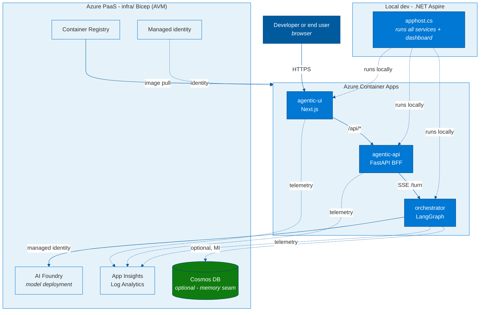

# Agentic Azure Blueprint

**A spec-driven, agentic Azure application shell** - Next.js frontend + FastAPI BFF + LangGraph
orchestrator, three Azure Container Apps wired by .NET Aspire, deployed with `azd`, and driven by
the [spec2cloud](https://github.com/EmeaAppGbb/spec2cloud) spec-driven-development (SDD) workflow.

## What's in the box

| Area | What you get |
|------|--------------|
| **Services** (`src/`) | `agentic-ui` (Next.js 16), `agentic-api` (FastAPI BFF), `orchestrator` (LangGraph) |
| **Local orchestration** _(optional)_ | `apphost.cs` - .NET Aspire runs all three + a dashboard; each service also runs standalone (see below) |
| **Infra** (`infra/`) | Bicep (Azure Verified Modules): Container Apps env, ACR, managed identity, App Insights, AI Foundry model |
| **Deploy** | `azure.yaml` + `azd up` |
| **SDD framework** (`.github/`) | spec2cloud agents, prompts, and 40+ skills |
| **SDD state** (`.spec2cloud/`) | `state.json` (resumable source of truth) + `audit.log` (append-only trail) |
| **Design docs** (`specs/`) | [LLD: LangGraph agent on Foundry](specs/lld-langgraph-foundry-agent.md), [Azure deployment requirements](specs/azure-deployment-requirements.md) |
| **Dev env** (`.devcontainer/`) _(optional)_ | Azure CLI, azd, Bicep, .NET + Aspire, Node/TypeScript, Docker-in-Docker, APM CLI |

## Building blocks



## Prerequisites

- **Azure CLI + `azd`** and an Azure subscription - the only hard requirement to deploy (`azd up`).
- For local development: Python 3.11+ with [uv](https://docs.astral.sh/uv/) and Node 20+.
- **Optional conveniences** (neither is required):
  - The [Dev Container](https://containers.dev/) (`.devcontainer/`) preinstalls everything below.
    Without it, install the tools yourself locally.
  - **.NET Aspire** (`apphost.cs`, needs .NET SDK 10) runs all three services + a dashboard with one
    command. You can skip Aspire entirely and run each service standalone instead (see below).

> **Docker is not required to deploy** - `azure.yaml` sets `remoteBuild: true`, so container images
> build in ACR. See [`specs/azure-deployment-requirements.md`](specs/azure-deployment-requirements.md)
> for the full subscription/RBAC/quota prerequisites.

## Run it locally

```bash
# Option A (optional convenience): all three services + Aspire dashboard
dotnet run apphost.cs

# Option B: run each service standalone (no Aspire / .NET required)
cd src/agentic-api  && uv run fastapi dev main.py   # http://localhost:8080
cd src/orchestrator && uv run fastapi dev main.py   # http://localhost:8000
cd src/agentic-ui   && npm install && npm run dev    # http://localhost:3000
```

## Deploy to Azure

```bash
azd auth login
azd up   # provisions infra (infra/) and deploys all three services (azure.yaml)
```

See [`specs/azure-deployment-requirements.md`](specs/azure-deployment-requirements.md) for
subscription prerequisites (RBAC, resource providers, model quota, region), and
[`specs/lld-langgraph-foundry-agent.md`](specs/lld-langgraph-foundry-agent.md) for the target-state
low-level design of the LangGraph-on-Foundry orchestrator.

### Deploy with GitHub Copilot (recommended)

Rather than running `azd up` yourself, let an agent drive the deployment end to end. Open this repo
in [GitHub Copilot CLI](https://docs.github.com/copilot/concepts/agents/about-copilot-cli) (or any agent that can run `az`/`azd`) and point it at the deployment spec:

```text
Read specs/azure-deployment-requirements.md and deploy this project to Azure.
Verify my az/azd login, check the gpt-4o-mini quota and resource providers in the target region,
run azd up to resource group rg-agentic-blueprint, then run the post-deploy smoke test
(./infra/scripts/postdeploy-smoke-test.ps1) and report back.
```

The agent uses [`specs/azure-deployment-requirements.md`](specs/azure-deployment-requirements.md) as the prerequisite checklist (RBAC, providers, quota, region, UI auth) and [`Spec2Cloud-about.md`](Spec2Cloud-about.md) 
for the spec-driven workflow context, so it can diagnose and resolve common provisioning blockers (quota, base-image pull limits) without you stepping 
through each command.

### Verify the deployment

After `azd up`, run the post-deploy smoke test to confirm everything works end to end:

```bash
./infra/scripts/postdeploy-smoke-test.ps1            # uses the default azd environment
# or target a specific resource group:
./infra/scripts/postdeploy-smoke-test.ps1 -ResourceGroup rg-<env>
```

It auto-discovers the deployment from the resource group and checks: ingress topology (only
`agentic-ui` is public; the BFF and orchestrator are internal-only), UI reachability, a full
streaming chat round-trip (browser → UI → BFF → orchestrator), that the internal apps are **not**
reachable from the internet, and that the Foundry model deployment plus its env vars are wired into
the orchestrator. It exits non-zero on any failure, so an agent or CI can gate on it. Requires the
`az` CLI (logged in) and `curl`.

## Build the app with Spec2Cloud (SDD)

After the initial deploy, you build the **real** application with the spec-driven workflow
(PRD → FRD → plan → implement → deploy). *This can run on a plain Windows workstation - **no
devcontainer required**, because every spec2cloud agent primitive (agents, prompts, skills, instructions) is
already committed and read natively by your github copilot agent harness.*

**1. Pick an agent harness** (one of):

- **GitHub Copilot CLI** - `npm install -g @github/copilot` (Node 22+), run `copilot`, then `/login`.
  See [Installing Copilot CLI](https://docs.github.com/copilot/how-tos/set-up/install-copilot-cli).
  This is what the `apm run …` scripts call under the hood.
- **VS Code + GitHub Copilot** - open the repo; the `.github/` agents/prompts/skills load natively
  (and wire the agents' MCP tools automatically).

**2. Install the stack toolchain** (for the implement/test/deploy loop):

- **Python 3.11+ and [`uv`](https://docs.astral.sh/uv/)** (for `agentic-api` + `orchestrator`)
- **Node 20+ and npm** - `agentic-ui` (Next.js, Playwright/Vitest)
- **`az` + `azd`** - per-increment deploy (already installed for the deploy above)
- _Optional:_ **.NET SDK 10** - only for `dotnet run apphost.cs` (Aspire local run)

> Docker is **not** required (host-process local run; ACR remote build).

**2b. (Optional) Wire the agent MCP tools.** The agents use MCP servers for grounding/research
(Microsoft Learn, Context7, DeepWiki), Azure ops (Azure MCP), GitHub issues, and Playwright. The repo
ships [`.vscode/mcp.json`](.vscode/mcp.json) - open the repo in VS Code and Copilot offers to start
the servers. **No GitHub PAT is needed:** the `github` server uses the **remote GitHub MCP endpoint
authenticated via your VS Code Copilot/GitHub sign-in** (OAuth). The `npx`-based servers need **Node**
and **network egress** to the npm registry, `learn.microsoft.com`, `mcp.deepwiki.com`, and Context7;
the `aspire` server needs the Aspire CLI. **All MCP tools are optional** - if one is unavailable the
agents fall back to built-in knowledge + `fetch`, and the PRD → … → deploy loop still runs.

**3. Run the SDD pipeline.**
Run each phase with whichever harness you picked in step 1:

- **GitHub Copilot CLI:**
  ```powershell
  copilot --allow-tool -p .github/prompts/prd.prompt.md   # then: frd, plan, implement, deploy
  ```
- **VS Code + Copilot:** open the Copilot **Chat** view and run the prompt as a slash command -
  type `/prd` (then `/frd`, `/plan`, `/implement`, `/deploy`). Workspace prompt files in
  `.github/prompts/` are auto-discovered; each one's `agent:` front-matter selects the right agent.

No `apm` install is needed - the prompts are already in the repo. (`apm` is the
[Agent Package Manager](https://github.com/microsoft/apm); `apm run prd` is just an optional alias
for the CLI command above. See [`Spec2Cloud-about.md`](Spec2Cloud-about.md) for the SDD workflow.)

State stays resumable in [`.spec2cloud/state.json`](.spec2cloud/state.json) (+ `audit.log`)
regardless of harness. See [`Spec2Cloud-about.md`](Spec2Cloud-about.md) for the full workflow.

## Author

Henry Bravo - Sr. Solution Engineer Microsoft Cloud & AI

## License

[MIT](LICENSE.md)
