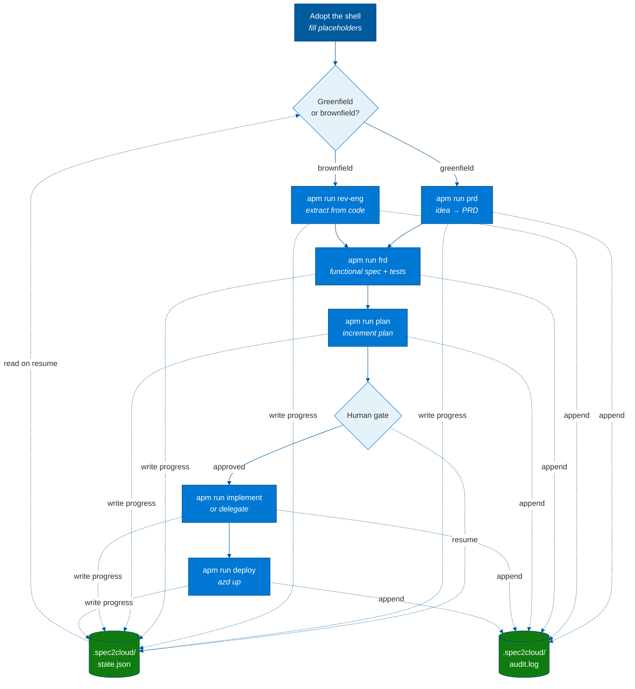

## Build your app with spec2cloud (SDD)

This shell is a [spec2cloud](https://github.com/EmeaAppGbb/spec2cloud) project developed and maintained by Microsoft EMEA GBB (Global Black Belt) team members.
Pick a path and let the agents drive:

- **Greenfield** - start from a product idea → PRD → FRD → tests → contracts → implement → deploy.
- **Brownfield** - reverse-engineer existing code → extract → spec-enable → testability gate →
  green baseline / behavioral docs → deliver. (This very repo was produced via the brownfield idea;
  see [`docs/analysis/`](docs/analysis/).)



```bash
apm install        # install the APM standards referenced in apm.yml
apm run prd        # or: copilot --allow-tool -p .github/prompts/prd.prompt.md
apm run frd
apm run plan
apm run implement  # or: apm run delegate
apm run deploy
```

State is resumable: `.spec2cloud/state.json` records `currentPhase`/progress and
`.spec2cloud/audit.log` records every significant action. A missing `state.json` starts at
Phase 0; the included one is a clean Phase 0 ready to begin. See `.github/skills/state-management`
and `.github/skills/resume`.

## Make it yours

1. Rename the project: `azure.yaml` `name:`, `SPEC2CLOUD.md` metadata, this README, `LICENSE.md`.
2. Fill placeholders (see [`docs/analysis/08-placeholders.md`](docs/analysis/08-placeholders.md)).
3. Replace the example routes / graph node / landing page with your domain.
4. Wire the production checklist in [`AGENTS.md`](AGENTS.md) (auth, RBAC, validation, telemetry, tests).