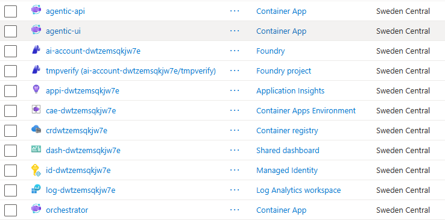

# Azure subscription requirements - deploying this project (`azd up`)

> What an Azure subscription needs to deploy this project with `azd up`.
> Section **A** covers the base shell (what `main` deploys today); section **B** covers the
> additions this customer's **target deployment** also requires (Cosmos DB for durable state,
> API Management as the AI gateway). **Entra ID sign-in is optional** - a built-in
> username/password gate is the fallback when directory permission to create app registrations
> is not available.

## A. Base shell - minimum to `azd up`

### A.1 Local tooling (developer / CI machine)

| Tool | Purpose | Notes |
|---|---|---|
| **Azure Developer CLI (`azd`)** | `azd up` (provision + deploy) | the only required deploy driver |
| **Azure CLI (`az`)** | auth, ad-hoc checks | `azd auth login` uses it |
| **Bicep** | IaC compile | bundled with `azd`/`az` |
| Docker | **not required for deploy** | `azure.yaml` sets `remoteBuild: true` → images build **in ACR**, no local daemon |
| .NET SDK 10, Python 3.11+ + `uv`, Node 20+ | **local run only** (`dotnet run apphost.cs`) | not needed to deploy - full local-dev guide in **C** |

> The dev container (`.devcontainer/`) ships all of the above preinstalled.

### A.2 Azure identity & RBAC (the principal running `azd up`)

`infra/main.bicep` is **subscription-scoped**: it creates the resource group *and* creates
**role assignments** (`ai-project.bicep` grants the deployer Azure AI Developer + Cognitive
Services User; `resources.bicep` grants each app's system-assigned identity AcrPull). Creating
role assignments requires `Microsoft.Authorization/roleAssignments/write`.

**Minimum required, at subscription scope:**

- **Owner**, *or*
- **Contributor** **+** **User Access Administrator** (Contributor alone **cannot** create the
  role assignments and the deployment will fail).

The deploying principal's object id and type flow in as `AZURE_PRINCIPAL_ID` /
`AZURE_PRINCIPAL_TYPE` (azd sets these). The conditional role grants to the deployer only fire
when `principalType == User`.

### A.3 Resource providers (must be registered on the subscription)

| Provider | For |
|---|---|
| `Microsoft.Resources` | resource group / deployments |
| `Microsoft.CognitiveServices` | Foundry (AI Services) account, project, model deployment |
| `Microsoft.App` | Container Apps environment + 3 container apps |
| `Microsoft.ContainerRegistry` | ACR (image build + pull) |
| `Microsoft.ManagedIdentity` | *system-assigned identities (no standalone `userAssignedIdentities` resource is created on this branch)* |
| `Microsoft.OperationalInsights` | Log Analytics workspace |
| `Microsoft.Insights` | Application Insights |
| `Microsoft.Portal` | provisioned dashboard |

Register any that are not yet registered, e.g. `az provider register --namespace Microsoft.App`.

For this customer's **target deployment**, also register **`Microsoft.DocumentDB`** (Cosmos DB
durable state) and **`Microsoft.ApiManagement`** (AI gateway) - see B.1 / B.2.

### A.4 Resources provisioned (and their SKUs)

From the verified provision run, the base shell creates:

- **Foundry / AI Services account** (`Microsoft.CognitiveServices`, kind `AIServices`, **S0**),
  a **Foundry project**, and one **model deployment**.
- **Container Registry** (**Basic**, admin user disabled - pull via managed identity).
- **Container Apps Environment** + **3 container apps** (ui external; api + orchestrator internal).
- **System-assigned managed identity** (one per app; each granted AcrPull). Model access is **not**
  granted to the apps directly - it goes through the mandatory APIM AI Gateway (B.2), whose own
  system-assigned identity holds the Cognitive Services role on the AI account.
- **Log Analytics workspace**, **Application Insights**, **Portal dashboard**.

> **Identity model (this branch).** The apps use **system-assigned** managed identity (one per
> Container App) instead of a shared user-assigned identity, so deployment succeeds where Azure
> Policy blocks `Microsoft.ManagedIdentity/userAssignedIdentities` (common in regulated/FSI tenants).
> Functionally equivalent - Foundry auth, ACR pull, and `DefaultAzureCredential` all work. Trade-offs:
> one identity per app (no shared identity), RBAC is assigned **after** each app exists (the first
> deploy runs the public placeholder image, so no ACR pull is needed before the role lands), and the
> identity is deleted with its app. **Model egress is fail-closed:** the deployed apps get no direct
> data-plane access to the AI account; enabling APIM (B.2) grants APIM's system-assigned identity the
> account role - that is the required, visible step that turns on model access. For a shared identity
> or pre-provisioned RBAC, use the user-assigned variant on `main`.

Networking and access controls:

- **Container Apps ingress** - only `agentic-ui` has **external** ingress (a public
  `*.azurecontainerapps.io` FQDN). Both `agentic-api` (BFF) and `orchestrator` have **internal**
  ingress (`ingressExternal: false`) and have **no public FQDN** - they are reachable only from
  inside the Container Apps environment. The browser never calls the BFF directly: the Next.js
  server (UI) proxies requests to the BFF server-side (`AGENT_API_URL` is a server-only variable),
  so in effect **only the UI can reach the BFF**, and only the BFF reaches the orchestrator.
- **Authentication** - the public UI can be protected two ways, and **Entra ID is optional**:
  - **Username/password gate (default fallback):** set `UI_AUTH_USERNAME` + `UI_AUTH_PASSWORD`
    on the `agentic-ui` container app to require sign-in before any page or API call (incl. the
    BFF proxy). Needs **no directory privilege**. Leave them unset to keep the UI open.
  - **Entra ID sign-in + OBO (optional, recommended when available):** requires Entra app
    registrations (see A.9) and directory privilege. Choose this when you need per-user identity
    or to call downstream APIs *as the signed-in user*.
  Either way, the BFF and orchestrator are already network-isolated (above); the chosen auth
  controls *who* may use the public UI.
- **PaaS data-plane** - the Foundry/Cognitive Services account and Cosmos DB use
  `publicNetworkAccess: Enabled` + `disableLocalAuth: false`: they accept traffic from public
  networks, secured by Entra / managed identity rather than by network isolation.

**No VNet / private endpoints are required** for the base shell. For further lock-down: place the
UI behind Front Door/App Gateway + WAF, and/or move the PaaS services to
`publicNetworkAccess: Disabled` + private endpoints.

> **Minimal deployed example.** A base-shell `azd up` (no Cosmos DB / APIM) into a throwaway
> resource group provisions exactly the resources below - three Container Apps (`agentic-api`,
> `agentic-ui`, `orchestrator`), a Foundry account + project, ACR, Container Apps environment,
> managed identity, Log Analytics, Application Insights, and a portal dashboard - all in one region
> (`swedencentral` here):
>
> 

### A.5 Azure OpenAI / model quota  ⚠️ most common blocker

The shell deploys **`gpt-4o-mini`**, format `OpenAI`, version `2024-07-18`, SKU
**`GlobalStandard`, capacity 10** (= 10K TPM). The subscription must have **≥10K TPM available
GlobalStandard quota for that model in the target region**, otherwise provisioning fails with an
insufficient-quota error.

- Check/raise quota in the Foundry/AI portal (or request an increase) before deploying.
- `aiDeploymentsLocation` can differ from the app `location` (separate azd env var) so the model
  can land in a region/quota that has capacity.

### A.6 Region

Pick a region that offers **AI Services (Foundry) + Azure Container Apps + ACR + the chosen
model SKU + API Management (AI gateway) + Azure Storage (Blob)**. The verified deployment used
**`swedencentral`**. Set via `AZURE_LOCATION` (and optionally `AZURE_AI_DEPLOYMENTS_LOCATION`).

### A.7 Subscription policy / type

- A subscription able to create **Cognitive Services / AI Services** accounts (not blocked by
  Azure Policy; Azure OpenAI is GA - no separate access request needed).
- No policy forcing private networking / denying public Cognitive Services, or the public-default
  Bicep must be adjusted first.

### A.8 `azd` environment inputs

`azd up` will prompt for / read: `AZURE_ENV_NAME`, `AZURE_LOCATION`, the subscription, and
`AZURE_PRINCIPAL_ID/TYPE` (auto). The postprovision hook is a **no-op stub** out of the box - it
creates **no** Entra app registrations unless you wire them (see A.9). For the username/password
gate, set `UI_AUTH_USERNAME` / `UI_AUTH_PASSWORD` on the `agentic-ui` container app.

### A.9 Entra ID app registrations - sign-in / OBO (**OPTIONAL**)  ⚠️ tenant privilege

Entra ID sign-in is **optional**. The default fallback is the username/password gate (A.4), which
needs no directory privilege. Choose Entra ID only when you need **per-user identity** or
**On-Behalf-Of (OBO)** to call downstream APIs *as the signed-in user*. It requires two app
registrations (SPA + API), which need **Entra (directory) privilege**, separate from Azure RBAC:

- The deploying account can create app registrations only if the tenant's
  `defaultUserRolePermissions.allowedToCreateApps = true`, **or** the account holds the
  **Application Developer** (or **Application Administrator**) Entra role.
- Check it:
  ```bash
  az rest --method GET --url "https://graph.microsoft.com/v1.0/policies/authorizationPolicy" \
    --query "defaultUserRolePermissions.allowedToCreateApps"
  ```
- If `false` and no Entra role: either use the **username/password gate** (no directory privilege
  needed), or have an admin create the two apps once and set the IDs via `azd env set`.

> **No Entra ⇒ no OBO.** Without a user token there is nothing to exchange, so the OBO flow is
> unavailable. Downstream Azure calls run as the app's **managed identity** (independent of user
> sign-in), and any per-user authorization must be enforced in the BFF.

## B. Deployment additions

The base shell runs without them, and **B** includes durable state and the AI gateway.

### B.1 Azure Cosmos DB - durable state

- Provider **`Microsoft.DocumentDB`**; account + SQL database + containers.
- Managed-identity data-plane access (RBAC), `publicNetworkAccess: Enabled` in the verified run.
- No extra subscription role beyond A.2.

### B.2 API Management - AI gateway / guardrails

- Provider **`Microsoft.ApiManagement`**; **StandardV2**, capacity 1, system-assigned identity.
- Guarded behind a flag (`AZURE_DEPLOY_APIM` / `deployApim`) - off by default; set
  `AZURE_DEPLOY_APIM=true` for the target deployment.
- For the content-safety policy, APIM's identity needs **Cognitive Services User** on a
  **Content Safety** resource.

> **Required when enabling APIM (do not skip - this is what turns on model access).** On this
> system-assigned branch the deployed apps have **no** direct data-plane access to the AI account by
> design. Enabling the gateway is the single, explicit step that wires model egress, so the APIM
> increment **must**:
> 1. Grant **APIM's system-assigned identity** `Cognitive Services OpenAI User` (model) and
>    `Cognitive Services User` (content safety) on the AI / Content Safety accounts.
> 2. Point `AZURE_OPENAI_ENDPOINT` at the **APIM gateway URL**, not the raw account (lld §5).
> 3. Keep the apps' identities free of any direct account role - all model traffic flows through APIM.
>
> Track this as a first-class task in the increment plan; without it, `deployApim=true` provisions
> the gateway but no model calls succeed.

## C. Local development - run it on a laptop (no Azure, no Docker)

> Local dev provisions **nothing in Azure** and needs **no container runtime**. All three
> services run as **host processes** - under Aspire **(optional)** or launched directly - and the
> orchestrator's model call is a built-in **offline echo stub** (`src/orchestrator/graph.py`
> `_generate`), so the app runs end-to-end with **no live AI Foundry endpoint**. This makes the
> local stack a self-contained **plan B**: you can build and demo the full UI → BFF → orchestrator
> flow before any Azure target environment exists.

### C.1 Why Docker is not needed locally

Neither way of running the app (Aspire **or** standalone - see C.3) needs a container runtime,
because the services are always **host processes**, never containers:

- `orchestrator` & `agentic-api` run via `uv`/`uvicorn`; `agentic-ui` runs via `npm run dev`.
- **Aspire doesn't change that.** Although Aspire is often associated with containers, in
  `apphost.cs` it only registers **host-process** resources (`AddUvicornApp(...).WithUv()`,
  `AddJavaScriptApp(...).WithNpm()`) - so `dotnet run apphost.cs` launches the same uvicorn/npm
  processes you'd start by hand, with no Docker daemon involved.
- `.PublishAsDockerFile()` applies only at **publish/deploy** time (`azd up`), not at
  `dotnet run apphost.cs`. The `Dockerfile`s in `src/*/` and `azure.yaml` build images **for Azure
  Container Apps** - they are not used by a local start.

A container runtime is needed **only** if you opt into containers locally - building/running an
image by hand, using the `.devcontainer/`, or running `azd package` locally. For plain dev (either
option in C.3), none of that applies. (Even `azd up` builds images **in ACR** via
`remoteBuild: true`, so a normal cloud deploy also needs no local Docker daemon - see A.1.)

### C.2 Local toolchain

| Tool | Purpose | Notes |
|---|---|---|
| **.NET SDK 10** | Aspire AppHost (`dotnet run apphost.cs`) | **only for the optional Aspire path**; matches `Aspire.AppHost.Sdk@13` in `apphost.cs` |
| **Python 3.11+ + `uv`** | `orchestrator` + `agentic-api` | `uv` runs uvicorn/FastAPI and installs deps |
| **Node 20+ + `npm`** | `agentic-ui` (Next.js 16) | `npm ci` / `npm run dev` (image is `node:20-slim`) |
| Docker | **not required** | only for local container builds or the optional dev container - C.1 |

> The dev container (`.devcontainer/`) ships all of the above preinstalled (and, being a
> container, is the one local path that *does* need a container runtime).

### C.3 Run it - Aspire is optional

**Aspire is a convenience, not a requirement.** It orchestrates all three services with one
command and adds a dashboard (logs, traces, endpoints), which is handy as a **plan B** while the
Azure target environment isn't ready yet. But the services are plain uvicorn/Next.js processes,
so you can skip Aspire entirely and run them directly - then **.NET SDK 10 is not needed**.

```bash
# Option 1 (optional): Aspire orchestrates all three services + dashboard. Needs .NET SDK 10.
dotnet run apphost.cs
# UI :3000  |  BFF :8080  |  orchestrator :8000  |  dashboard :15888

# Option 2: run each service directly (no Aspire, no .NET), in three terminals:
cd src/orchestrator && uv run fastapi dev main.py
cd src/agentic-api  && uv run fastapi dev main.py
cd src/agentic-ui   && npm run dev
```

Either option behaves identically at the app level; Aspire just wires the inter-service env vars
(`ORCHESTRATOR_URL`, `AGENT_API_URL`) and waits for dependencies for you. Running directly, set
those yourself (see the per-service `.env` files in AGENTS.md).

The shell answers with the offline echo stub out of the box. To exercise a **real model** locally,
point `AZURE_OPENAI_ENDPOINT` / `AZURE_OPENAI_DEPLOYMENT_NAME` at a deployment and wire `_generate`
to it (via managed identity / `DefaultAzureCredential`, never API keys) - see the TODO in
`src/orchestrator/graph.py`. No model wiring is required just to run the app.

### C.4 Workstation prerequisites (network / access)

- **[VS Code + GitHub Copilot](https://docs.github.com/en/copilot/how-tos/set-up/install-copilot-extension)**
  (or another editor: JetBrains IDEs, Visual Studio, Eclipse, Vim/Neovim, Xcode, Azure Data Studio
- **Python + npm package access** - reach **PyPI** (for `uv`) and the **npm registry** to restore
  dependencies; an internal mirror/proxy works equally well.
- **Container base-image access** - **only if** you build images locally or use the dev container:
  pull access to the relevant registries (Docker Hub, **GHCR**, **ACR**, etc.). Not needed for a
  plain host-process dev run.
- **Shared GitHub repository** - obvious but recommended so a prototype team works off one source
  of truth.

## Quick checklist

**Required**

- [ ] `azd` (+ `az`) installed and `azd auth login` completed - A.1
- [ ] **Owner**, *or* **Contributor + User Access Administrator**, at subscription scope
      (needed to create the role assignments in `infra/`; Contributor alone fails) - A.2
- [ ] Base resource providers registered (A.3): `Microsoft.Resources`,
      `Microsoft.CognitiveServices`, `Microsoft.App`, `Microsoft.ContainerRegistry`,
      `Microsoft.ManagedIdentity`, `Microsoft.OperationalInsights`, `Microsoft.Insights`,
      `Microsoft.Portal`
- [ ] Target-deployment providers registered: **`Microsoft.DocumentDB`** (Cosmos DB state) and
      **`Microsoft.ApiManagement`** (AI gateway) - B.1 / B.2
- [ ] **≥10K TPM GlobalStandard quota** for `gpt-4o-mini` (or the chosen model - *tbd*) in the
      model region; raise quota *before* deploying - A.5
- [ ] Target region supports **Foundry (AI Services) + Azure Container Apps + ACR + the model SKU
      + API Management (AI gateway) + Azure Storage (Blob)** - A.6
- [ ] `AZURE_ENV_NAME`, `AZURE_LOCATION` (and optionally `AZURE_AI_DEPLOYMENTS_LOCATION`) set - A.8
- [ ] UI access control decided: set `UI_AUTH_USERNAME` + `UI_AUTH_PASSWORD` on `agentic-ui` for
      the username/password gate (no directory privilege required) - A.4
- [ ] Subscription **can create Cognitive Services / AI Services** accounts (not Azure-Policy-blocked;
      Azure OpenAI is GA, no separate access request) - A.7
- [ ] No policy forcing private networking / denying public Cognitive Services **unless** you adjust
      the public-default Bicep first - A.7

**Nice to have**

- [ ] **Entra app-registration privilege** (A.9) - a directory role or tenant policy that allows
      creating app registrations - *only if* you choose Entra ID sign-in / OBO instead of the
      username/password gate
