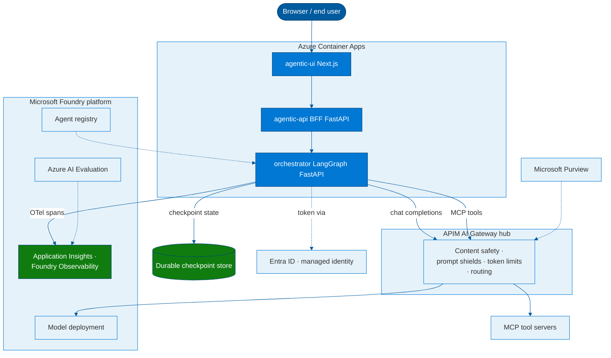
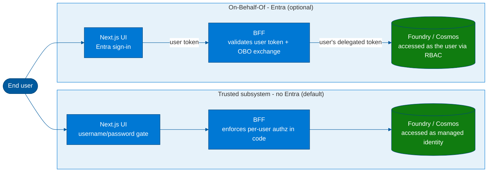
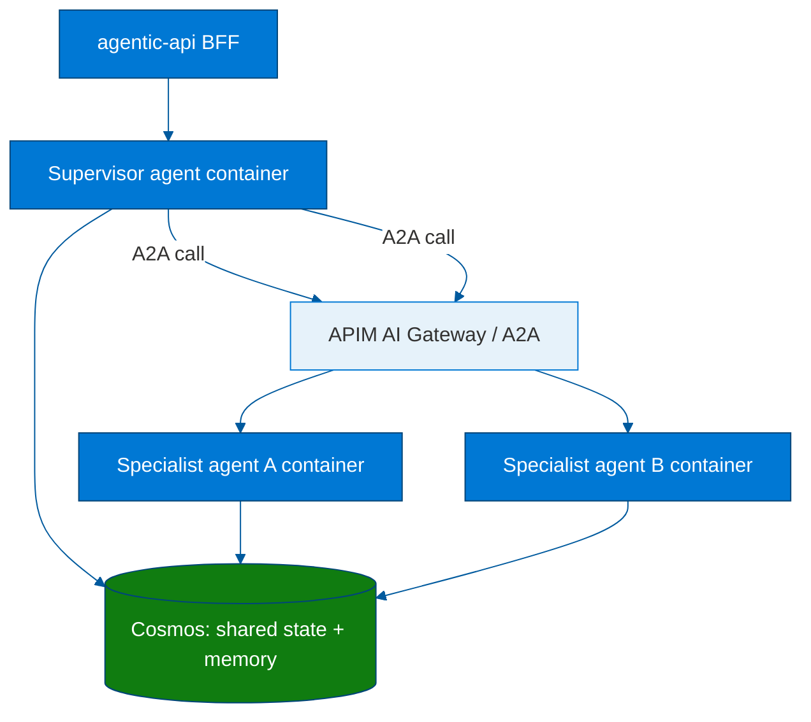
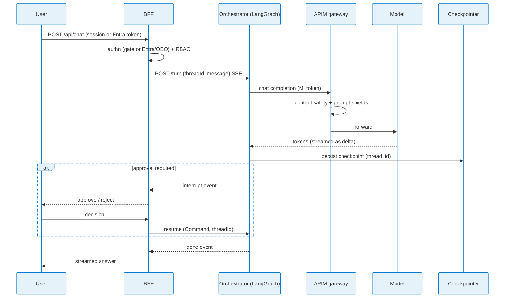

# LLD - LangGraph agent on Microsoft Foundry (Azure Container Apps runtime)

> **Document type:** Low-Level Design (target state). This describes **how the agent
> *should* be built**, not the current state of the reference shell. The repository today
> ships stubbed seams (`src/orchestrator/graph.py`, `checkpointer.py`); this LLD specifies
> the design those seams are meant to be filled with.
>
> **Status:** Draft · **Scope:** single LangGraph orchestrator service · **Runtime:** Azure
> Container Apps (containerized via Docker; portable to any OCI-compliant container platform).

---

## 1. Purpose & scope

This LLD specifies, in implementation detail, how a **LangGraph** agent is developed so that
it consumes **Microsoft Foundry as the platform** while running as a **self-hosted container
on Azure Container Apps (ACA)**, routed through an **API Management (APIM) AI Gateway** hub.

The driving requirement is a *capability matrix*: a set of enterprise features that must be
delivered by **LangGraph + Foundry on a customer-operated container runtime**, rather than
being exclusive to a managed agent runtime or a first-party framework. This document proves
those capabilities out as concrete design, with the exact packages, APIs, configuration, and
the place in this repository where each one lands.

The runtime is treated as **a portable container**: the agent is packaged as a Docker image
and deployed to ACA. Nothing in the design is ACA-specific beyond the deployment manifest;
the same image runs unchanged on any Kubernetes-based container platform.

### Capability matrix covered

| # | Capability | Delivered by | §  |
|---|---|---|---|
| 1 | Model access (Foundry model catalog) | Foundry deployment via APIM gateway + managed identity | §5 |
| 2 | Agent identity | Managed identity / Entra workload identity | §6 |
| 3 | Observability & tracing | OpenTelemetry → Application Insights → Foundry portal | §7 |
| 4 | Durability, session & state | LangGraph persistence (checkpointer + Store) on Cosmos DB | §8 |
| 5 | Human-in-the-loop | LangGraph `interrupt()` | §9 |
| 6 | Tools (function calling) | Native Python `@tool` functions and/or `langchain-mcp-adapters` + APIM-fronted MCP servers | §10 |
| 7 | Multi-agent orchestration & topology | LangGraph nodes/sub-graphs (in-process) or per-agent containers via A2A | §11 |
| 8 | Safety / guardrails | APIM `llm-content-safety` (Content Safety + Prompt Shields) | §12 |
| 9 | Evaluation & testing | Azure AI Evaluation SDK (local + CI) | §13 |
| 10 | Lifecycle & registry | CI/CD build → image → ACA → Foundry registration | §14 |
| 11 | Governance / compliance / audit | APIM hub + Entra + Purview around the agent | §15 |

---

## 2. Architecture overview



**Key design rule:** the agent never talks to a model endpoint directly. **All** model and
remote-tool traffic egresses through the APIM AI Gateway, which is where platform guardrails,
identity enforcement, token governance, and auditing are applied. This is what lets a
self-hosted LangGraph container inherit Foundry-platform governance without being on a managed
agent runtime.

---

## 3. Component responsibilities (maps to current repo)

| Component | Path | Responsibility |
|---|---|---|
| UI | `src/agentic-ui` | Next.js front end; talks only to the BFF. |
| BFF | `src/agentic-api/app.py` | Backend-for-frontend. Authenticates the caller (username/password gate by default, or optional Entra token + OBO), enforces RBAC, proxies the turn to the orchestrator as SSE. The browser never reaches the orchestrator (and never the BFF directly - §6.1). |
| Orchestrator | `src/orchestrator/` | Hosts the LangGraph agent. Exposes `POST /turn` as an SSE stream. **This is the subject of this LLD.** |
| Checkpointer seam | `src/orchestrator/checkpointer.py` | Pluggable durable state store behind a `get/put` (target: LangGraph `BaseCheckpointSaver`). |
| Orchestration | `apphost.cs` | Aspire local orchestration; `infra/` for ACA deployment. |

---

## 4. The LangGraph agent - core design

### 4.1 State

The agent state is an explicit, typed channel object. It is the contract for checkpointing,
multi-agent hand-off, and HITL resumption.

```python
from typing import Annotated, Any, TypedDict
from langgraph.graph.message import add_messages

class AgentState(TypedDict, total=False):
    messages: Annotated[list, add_messages]   # conversation; reducer appends
    citations: list[Any]
    pending_approval: dict | None             # set when an interrupt is raised
```

> Per repo convention, agent state shared between API and Web is declared as a TypeScript
> interface in `src/shared/types/`; the Python `TypedDict` above is its server-side mirror.

### 4.2 Graph shape

`build_graph()` (replacing the single-node echo in `graph.py`) compiles a `StateGraph` with:

- a **model node** that calls the Foundry model through APIM (§5),
- a **tools node** bound to the agent's tools - native Python `@tool` functions and/or MCP tools (§10),
- a conditional edge that loops model ↔ tools until the model stops calling tools,
- optional **approval interrupts** before high-impact tool calls (§9).

```python
from langgraph.graph import START, END, StateGraph
from langgraph.prebuilt import ToolNode, tools_condition

def build_graph(model, tools, checkpointer):
    g = StateGraph(AgentState)
    g.add_node("model", lambda s: {"messages": [model.invoke(s["messages"])]})
    g.add_node("tools", ToolNode(tools))
    g.add_edge(START, "model")
    g.add_conditional_edges("model", tools_condition)  # -> "tools" or END
    g.add_edge("tools", "model")
    return g.compile(checkpointer=checkpointer)   # durable state (§8)
```

### 4.3 Streaming contract (unchanged)

`stream_turn(thread_id, message)` keeps the existing SSE event shape so the BFF/UI are
untouched: zero or more `{"type":"delta","text":...}` then exactly one
`{"type":"done","answer":...,"citations":[...]}`. The graph is run with
`graph.stream(..., stream_mode="messages")` and tokens are mapped to `delta` events. The
`thread_id` is passed as `config={"configurable": {"thread_id": thread_id}}` so the
checkpointer scopes state per conversation.

---

## 5. Capability 1 - Model access (Foundry catalog via APIM + managed identity)

**Target design.** The model node uses the OpenAI-compatible chat-completions surface exposed
by the **APIM AI Gateway**, which fronts the Foundry model deployment. APIM can expose one or
many Foundry/3rd-party models through a single OpenAI-compatible endpoint and apply governance
once. ([AI gateway capabilities](https://learn.microsoft.com/en-us/azure/api-management/genai-gateway-capabilities))

**No API keys.** Authentication is **managed identity** via `DefaultAzureCredential` and a
bearer-token provider - never static keys.

```python
import os
from azure.identity import DefaultAzureCredential, get_bearer_token_provider
from langchain_openai import AzureChatOpenAI

token_provider = get_bearer_token_provider(
    DefaultAzureCredential(managed_identity_client_id=os.environ["AZURE_CLIENT_ID"]),
    "https://cognitiveservices.azure.com/.default",
)

model = AzureChatOpenAI(
    azure_endpoint=os.environ["AZURE_OPENAI_ENDPOINT"],   # APIM gateway URL
    azure_deployment=os.environ["AZURE_OPENAI_DEPLOYMENT_NAME"],
    api_version="2024-10-21",
    azure_ad_token_provider=token_provider,
)
```

**Repo wiring already present:** `infra/resources.bicep` injects `AZURE_OPENAI_ENDPOINT`,
`AZURE_OPENAI_DEPLOYMENT_NAME`, and `AZURE_CLIENT_ID` (user-assigned MI) into every container.
`infra/ai-project.bicep` provisions the Foundry account + project + a `gpt-4o-mini` deployment.
**Design change:** point `AZURE_OPENAI_ENDPOINT` at the APIM gateway, not the raw account, so
guardrails (§12) are inescapable.

**Dependencies to add** (`src/orchestrator/pyproject.toml`, currently commented out):
`langchain-openai`, `azure-identity`.

---

## 6. Capability 2 - Agent identity

**Target design.** The container authenticates with a **user-assigned managed identity**
(already provisioned: `infra/resources.bicep` `uami`, injected as `AZURE_CLIENT_ID`). The same
identity is granted **Cognitive Services User / Foundry User** on the model/project and
**AcrPull** on the registry. `DefaultAzureCredential` resolves it at runtime.

Identity is **platform-level**, not runtime-specific: workload/managed identity and Entra
agent identity apply to any agent the platform fronts, regardless of where the container runs.

**BFF authentication (front door) - optional.** Controlling *who* may use the app is layered on
top of the network isolation (§6.1) and is **optional**:

- **Username/password gate (default fallback):** an env-driven gate in the UI
  (`UI_AUTH_USERNAME` / `UI_AUTH_PASSWORD`) requires sign-in before any page or API call (incl. the
  BFF proxy), needing **no Entra directory privilege**.
- **Entra ID sign-in + On-Behalf-Of (recommended when available):** `src/agentic-api/app.py`
  validates the inbound Entra access token and performs OBO, enforcing RBAC at the BFF. Choose this
  for per-user identity or to call downstream APIs *as the signed-in user*.

> **No Entra ⇒ no OBO.** Without a user token there is nothing to exchange, so the OBO flow is
> unavailable. Downstream Azure calls run as the **managed identity** above (independent of user
> sign-in), and any per-user authorization must be enforced in the BFF (see **§6.2** for the
> OBO-vs-trusted-subsystem alternative).

### 6.1 BFF network isolation - only the UI may call the BFF

The BFF must be restricted so that **only the UI** reaches it, the available controls and their strength 
depend on the **UI→BFF call topology**. This shell uses `AGENT_API_URL` as a **server-only**
env var, and Next.js adds **server-side proxy routes** (e.g. `/api/me`). The intended path is therefore 
**browser → Next.js server → BFF**, which makes real network-level isolation feasible. Controls, weakest → strongest:

| # | Control | What it restricts | Strength |
|---|---------|-------------------|----------|
| 1 | **CORS** (UI origin allow-list) | Which *browser origin* may read responses | Weak - browser-only; non-browser clients (curl) ignore it. Not access control. |
| 2 | **Internal BFF ingress** (`ingressExternal: false`) + Next.js server proxy | BFF has **no public FQDN**; reachable only from inside the Container Apps environment (i.e. the UI) | Strong - genuine network isolation, identical to how the orchestrator is already locked down. Requires relaying SSE through a Next.js route handler. |
| 3 | **IP restrictions** (`ipSecurityRestrictions`) on an external BFF | Caller source IP (= the env's static outbound IP when the UI calls server-side) | Medium - brittle; prefer #2. |
| 4 | **Entra auth / OBO** at the BFF (+ optional UI-injected shared header) | *Who* may use the BFF (and optionally "came via the UI") | Real - the actual data-protection boundary. |

We make the BFF **internal** (`ingressExternal: false`, same ACA environment as the UI) 
and proxy browser calls through the Next.js server - this network isolation
is the **mandatory baseline** and is independent of authentication. UI authentication is layered on
top and **optional**: the default fallback is a username/password gate
(`UI_AUTH_USERNAME` / `UI_AUTH_PASSWORD`), and Entra ID sign-in / OBO is used when available (§6).

### 6.2 Per-user identity without Entra - OBO vs. trusted subsystem

OBO is an **Entra-specific** flow: the BFF exchanges the signed-in user's token for a downstream
token so the *resource* enforces per-user authorization. With no Entra there is no user token to
exchange - but per-user behaviour is still achievable via the **trusted-subsystem** pattern, which
is what this shell uses by default:

1. **Front door authenticates the user** - the username/password gate (or any future IdP).
2. **BFF enforces authorization itself** - per-user rules live in BFF code, not delegated to the resource.
3. **Downstream calls run as the app's managed identity** - Foundry (via APIM) and Cosmos (target)
   use managed-identity RBAC, independent of user sign-in.

| | OBO (Entra) | Trusted subsystem (no Entra, default) |
|---|---|---|
| Downstream identity | the user | the app (managed identity) |
| Who enforces per-user authz | the resource (RBAC) | the BFF (app code) |
| Per-user data isolation | native | app-layer (e.g. partition Cosmos by the session's user id, scope queries) |
| Directory privilege needed | yes | none |
| Downstream audit shows | the user | the app |

The only capability genuinely lost without Entra is **end-to-end user identity at the resource**
(data-plane RBAC / audit showing the real user). Authentication and per-user authorization are
preserved; their *enforcement point* simply moves from the resource to the BFF.



## 7. Capability 3 - Observability & tracing (OTel → App Insights → Foundry)

**Verified target design.** Foundry documents a **first-class path for LangChain/LangGraph
agents hosted *outside* a managed runtime**: the **Microsoft OpenTelemetry distro**
(`microsoft-opentelemetry`) enables the Azure Monitor exporter and auto-instruments LangChain/
LangGraph, tagging spans with agent identity so they render in the Foundry **Observability →
Traces** view. ([Configure tracing for AI agent frameworks](https://learn.microsoft.com/en-us/azure/foundry/observability/how-to/trace-agent-framework))

```python
from microsoft.opentelemetry import use_microsoft_opentelemetry

use_microsoft_opentelemetry(
    enable_azure_monitor=True,
    sampling_ratio=1.0,
    instrumentation_options={
        "langchain": {
            "enabled": True,
            "agent_id": os.environ["AGENT_ID"],
            "agent_name": os.environ["AGENT_NAME"],
        },
    },
)
```

**Configuration:**

- `APPLICATIONINSIGHTS_CONNECTION_STRING` - already injected by `infra/resources.bicep`
  (App Insights provisioned via the `monitoring` module).
- Content capture is **off in production**; enable only in dev via
  `OTEL_INSTRUMENTATION_GENAI_CAPTURE_MESSAGE_CONTENT=SPAN_AND_EVENT`,
  `OTEL_SEMCONV_STABILITY_OPT_IN=gen_ai_latest_experimental`,
  `AZURE_EXPERIMENTAL_ENABLE_GENAI_TRACING=true`.

**Dependency to add:** `microsoft-opentelemetry` (Python only for LangChain/LangGraph today).
**Preview note:** LangChain/LangGraph tracing integration is evolving; verify on the day of
implementation. Deeper/3rd-party evaluation tooling can layer on the same OTel stream without
replacing Foundry tracing.

**This proves matrix row 3:** a LangGraph container on ACA exports the *same* traces into the
*same* Foundry Observability surface as any other registered agent.

## 8. Capability 4 - Durability, session & state

### 8.1 Mechanism vs backing store (the key decision)

> **"Standardize on Cosmos" and "use LangGraph built-in state" are not alternatives.**
> LangGraph's built-in persistence is the **mechanism** we standardize on; the durable
> database behind it (Cosmos, Postgres, Redis) is a **deployment choice**. The platform
> requirement *"LangGraph supplies its own persistence"* refers to this mechanism - the graph
> stays store-agnostic, and the store is swapped behind a stable interface.

LangGraph persistence has **two tiers**, and the agent uses both:

| Tier | LangGraph abstraction | Scope | Purpose | Keyed by |
|---|---|---|---|---|
| **Short-term (session)** | `BaseCheckpointSaver` (checkpointer) | one conversation thread | resumability, pause/resume, HITL, crash recovery | `thread_id` |
| **Long-term (memory)** | `BaseStore` (store) | across threads / per user | durable facts, preferences, cross-session memory | namespace + key |

`thread_id` **is the session key.** A session = a checkpointed thread; multi-turn memory and
HITL both ride on it. Long-term memory that must outlive a session goes in the `Store`.

### 8.2 Standardized backing store: Azure Cosmos DB

We standardize the durable backing store on **Azure Cosmos DB** - Azure-native, globally
distributed, managed-identity auth, NoSQL document model that fits checkpoint blobs and
namespaced memory, and a natural partition key (`thread_id`). This is the right default for
this platform.

```python
import os
from azure.identity.aio import DefaultAzureCredential

async def build_checkpointer():
    """Durable, store-agnostic checkpointer behind a stable seam (replaces checkpointer.py)."""
    if endpoint := os.getenv("AZURE_COSMOS_ENDPOINT"):
        from langgraph_checkpoint_cosmosdb import CosmosDBSaver   # community package
        return CosmosDBSaver(
            endpoint=endpoint,
            credential=DefaultAzureCredential(),
            database="agent-state",
            container="checkpoints",
        )
    from langgraph.checkpoint.memory import InMemorySaver
    return InMemorySaver()   # dev only - never in production
```

The compiled graph receives it via `graph.compile(checkpointer=...)`, so every super-step is
persisted and the agent is **resumable** after restart/scale. **State persistence is supplied
by the framework**, not the runtime - identical on any container host.

> **Identity note.** `DefaultAzureCredential` above resolves the container's **managed (workload)
> identity** (§6) for Cosmos **data-plane RBAC** - it is **independent of the optional Entra _user_
> sign-in / OBO** (§6.2). The no-Entra path does **not** change this code: the managed identity is
> always provisioned and is what accesses Cosmos (and Foundry, ACR), regardless of whether users sign in.

> **Maturity caveat (verify at implementation time):** the first-party LangGraph savers are
> `InMemorySaver`, `SqliteSaver`, and **Postgres** (`langgraph-checkpoint-postgres`). A Cosmos
> saver (`langgraph-checkpoint-cosmosdb`) exists on PyPI but is **community-maintained**. If its
> maturity is insufficient, implement a thin `BaseCheckpointSaver`/`BaseStore` over the Cosmos
> SDK with managed identity - the graph code does not change either way. **Azure Database for
> PostgreSQL Flexible Server** with the first-party `AsyncPostgresSaver` is the supported
> fallback. Either choice satisfies the "LangGraph Persistence" platform requirement.

> Replaces the current `checkpointer.py`, whose Cosmos placeholder silently falls back to
> in-memory - the silent fallback must be removed from production builds.

## 9. Capability 5 - Human-in-the-loop

**Target design.** Use LangGraph's **`interrupt()`** primitive inside a node to pause the
graph, persist state via the checkpointer (§8), and surface an approval request to the user.
Execution resumes with `Command(resume=...)` on the same `thread_id`.

```python
from langgraph.types import interrupt, Command

def approval_node(state: AgentState):
    decision = interrupt({"action": state["pending_approval"]})  # pauses here
    if decision != "approve":
        return {"messages": [("system", "Action rejected by user.")]}
    return {}   # proceed
```

**Wire-up:** the orchestrator emits a `{"type":"interrupt","payload":...}` SSE event; the BFF/
UI render an approve/reject control; the resume call hits `POST /turn` with the decision and
the same `threadId`. Durable checkpointing makes the pause survivable across restarts.

## 10. Capability 6 - Tools (native functions and MCP)

**Target design.** The `ToolNode` (§4.2) binds **LangChain tools** and is **agnostic to where a tool
comes from** - `MultiServerMCPClient.get_tools()` simply *adapts* MCP-server tools into the same
`BaseTool` type that a `@tool`-decorated Python function produces. Two sources are supported and
**compose freely**; MCP is **optional**.

### 10.1 Native Python tools (deterministic baseline)

Plain Python functions decorated with `@tool` are first-class LangChain tools. They run **in-process**
- no MCP server, no network hop, no external dependency - so they are the right choice when a customer
**cannot run MCP** or needs **deterministic / offline** tool calling. They can be the sole source, a
supplement to MCP, or a fallback when MCP is unavailable.

```python
from langchain_core.tools import tool

@tool
def lookup_policy(policy_id: str) -> dict:
    """Return policy details for a given id."""
    ...  # deterministic, in-process; validate inputs, log, handle errors
```

### 10.2 MCP tools (optional, governed)

Bind tools from MCP servers using **`langchain-mcp-adapters`** (`MultiServerMCPClient.get_tools()`),
then pass them to the `ToolNode` (§4.2). MCP servers are **fronted by APIM**, so tool traffic is
governed and content-safety-checked like model traffic - APIM's `llm-content-safety` policy explicitly
applies to **MCP tools and A2A APIs**.
([genai-gateway-capabilities](https://learn.microsoft.com/en-us/azure/api-management/genai-gateway-capabilities),
[llm-content-safety-policy](https://learn.microsoft.com/en-us/azure/api-management/llm-content-safety-policy))

**Dependency to add:** `langchain-mcp-adapters`.
**Note:** the repo's `.mcp.json` is **dev-time tooling for the coding agent only** - it is not
the runtime tool surface and must not be confused with it.

### 10.3 Composing the two

Both sources yield the same `BaseTool`, so they concatenate into the **one** tool list that
`build_graph(...)` already accepts (§4.2) - the graph wiring is **unchanged**:

```python
from langchain_mcp_adapters.client import MultiServerMCPClient

async def load_tools():
    local = [lookup_policy]                  # native tools - always available
    mcp = []
    if os.getenv("MCP_GATEWAY_URL"):         # MCP is optional
        client = MultiServerMCPClient({
            "domain_tools": {"url": os.environ["MCP_GATEWAY_URL"], "transport": "streamable_http"},
        })
        mcp = await client.get_tools()
    return local + mcp                        # one flat list -> one ToolNode
```

With `MCP_GATEWAY_URL` unset the agent runs on **native tools alone**.

**Governance trade-off.** MCP tool traffic passes through **APIM** (content-safety, audit - §10.2 / §12).
Native tools run in-process and **bypass that hop**, so their safety is the developer's responsibility:
validate inputs (Pydantic), use structured logging, and wrap every external call in error handling per
repo conventions. Model-traffic content safety (§12) still applies regardless of the tool source.

## 11. Capability 7 - Multi-agent orchestration, topology & shared state

Multi-agent coordination is **graph-native** in LangGraph: each agent is a node (or a compiled
sub-graph) and hand-off is an edge that routes shared state. The design supports **multiple
LangGraph agents**, and there are two deployment topologies - the choice drives how session and
state are wired.

### 11.1 Topology A - in-process (agents *inside* the orchestrator container)

Multiple agents are compiled as **nodes / sub-graphs in one graph**, running in the existing
orchestrator container.

- **Coordination:** supervisor/router node routes to specialist sub-graphs; hand-off is an edge.
- **Session & state:** all agents share **one `AgentState`** and **one checkpointer** keyed by
  `thread_id` (§8). Hand-off is in-process - no serialization, no network hop.
- **Use when:** agents are tightly coupled, share a turn, and are owned/deployed together. This
  is the **default** and the simplest path; the single-node `graph.py` is its degenerate case.

### 11.2 Topology B - multi-container (each agent its *own* container)

Each agent is its **own LangGraph service + Docker image + ACA app**, registered independently
in the Foundry registry, communicating **agent-to-agent (A2A) over the APIM hub**.



- **Coordination:** a supervisor agent calls specialist agents via **A2A** (framework-agnostic
  framework-agnostic, so a LangGraph agent and another framework's agent interoperate) routed through
  APIM - so the same guardrails (§12), identity (§6), and audit (§15) apply to inter-agent
  traffic, not just model traffic.
- **Session & state:** there is **no shared process**, so agents do **not** share an in-memory
  `AgentState`. State is shared two ways:
  - **Correlation:** the originating `thread_id` is propagated on every A2A call so all agents'
    checkpoints and traces correlate to one session.
  - **Shared store:** cross-agent facts live in the **Cosmos-backed `Store`** (§8.1), namespaced
    per agent/session; each agent keeps its **own checkpointer** (own thread namespace) for its
    internal steps. Pass only the needed slice over A2A - not the whole state object.
- **Use when:** agents are independently owned, versioned, scaled, or deployed by different
  teams; or when an agent must be reused by multiple callers. Higher operational cost, looser
  coupling, lower blast radius.

### 11.3 Decision guidance

| Question | Lean Topology A (in-process) | Lean Topology B (multi-container) |
|---|---|---|
| Same owner / lifecycle? | Yes | No |
| Share one user turn / tight loop? | Yes | No |
| Independent scaling / reuse by others? | No | Yes |
| Operational simplicity priority? | Yes | No |
| Cross-framework interop (A2A)? | No | Yes |

**Recommendation:** start with **Topology A** (one orchestrator container, agents as
sub-graphs, one Cosmos-backed checkpointer). Promote a sub-graph to its **own container
(Topology B)** only when it needs independent ownership, scaling, or reuse. Both honor the same
state mechanism (§8) and the same hub-mediated governance - the topology is an operational
choice, not a capability change.

## 12. Capability 8 - Safety / guardrails

**Verified target design.** Guardrails are enforced **at the APIM AI Gateway**, not in agent
code, via the **`llm-content-safety`** policy, which sends prompts/completions to **Azure AI
Content Safety**, supports **Prompt Shields** (`shield-prompt="true"`) and custom blocklists,
and returns **403** on detection - applied uniformly to model calls *and* MCP/A2A tool calls.
([llm-content-safety-policy](https://learn.microsoft.com/en-us/azure/api-management/llm-content-safety-policy))

Policy outline (lives in the APIM hub, not in this repo):

```xml
<llm-content-safety backend-id="content-safety-backend" shield-prompt="true">
  <categories output-type="EightSeverityLevels">
    <category name="Hate" threshold="4" />
    <category name="Violence" threshold="4" />
  </categories>
</llm-content-safety>
```

**Prerequisite:** APIM's managed identity holds **Cognitive Services User** on the Content
Safety resource. Because the agent egresses *only* through the gateway (§2), guardrails are
**inescapable** - this is the mechanism by which a self-hosted LangGraph agent inherits
platform-level responsible-AI controls.

## 13. Capability 9 - Evaluation & testing

**Verified target design.** Use the **Azure AI Evaluation** capability via the Foundry SDK
(`azure-ai-projects>=2.0.0`) with `DefaultAzureCredential` and built-in evaluators for quality,
safety, and agent behavior; results are viewable in Foundry and runnable in CI.
([Evaluate your AI agents](https://learn.microsoft.com/en-us/azure/foundry/observability/how-to/evaluate-agent),
[Run evaluations from the SDK](https://learn.microsoft.com/en-us/azure/foundry/how-to/develop/cloud-evaluation))

- **Local/CI gate:** a `src/orchestrator/tests/eval/` suite runs a curated dataset through the
  graph and asserts evaluator scores meet thresholds (e.g., task adherence ≥ 0.85).
- **`AZURE_AI_PROJECT_ENDPOINT`** is already produced by `infra/main.bicep` outputs.
- The evaluation SDK is **callable from any runtime/CI pipeline** - it is not tied to a
  managed agent runtime (proves matrix row 9).

**Dependency to add:** `azure-ai-projects` (test/eval dependency group).

## 14. Capability 10 - Lifecycle & registry

**Target design.** Standard container lifecycle, registered into the platform:

```mermaid
%%{init: {'theme':'base','themeVariables':{'primaryColor':'#E6F2FA','primaryTextColor':'#323130','primaryBorderColor':'#0078D4','secondaryColor':'#E6F2FA','secondaryTextColor':'#323130','secondaryBorderColor':'#0078D4','tertiaryColor':'#E6F2FA','tertiaryTextColor':'#323130','clusterBkg':'#E6F2FA','clusterBorder':'#0078D4','titleColor':'#323130','textColor':'#323130','edgeLabelBackground':'#ffffff','lineColor':'#005A9E','fontFamily':'Segoe UI'}}}%%
flowchart LR
    src[Source commit] --> build[CI build + unit + eval gate]
    build --> img[Docker image to ACR]
    img --> deploy[azd deploy to Container Apps]
    deploy --> regstep[Register agent in Foundry registry]

    classDef appNode fill:#0078D4,stroke:#004578,color:#fff
    classDef paasNode fill:#E6F2FA,stroke:#0078D4,color:#323130
    class src,build,img,deploy appNode
    class regstep paasNode
```



- **Build:** the existing `Dockerfile` packages the orchestrator; CI runs unit tests + the
  evaluation gate (§13) before publishing the image to **ACR** (provisioned; MI has AcrPull).
- **Deploy:** `azd deploy` / `infra/` rolls the new revision onto ACA (revisions give
  versioned rollback at the platform layer).
- **Register:** a CI step registers the agent version into the **Foundry agent registry** so
  it is centrally discoverable and governed - the registry is platform-level; container-hosted
  agents register via CI/CD (proves matrix row 10).

## 15. Capability 11 - Governance / compliance / audit

**Target design.** Governance is composed *around* the agent, not inside it:

- **APIM hub** - single egress for models + MCP tools; central point for guardrails (§12),
  token limits, request logging, and policy.
- **Entra** - identity for the agent (§6) and OBO user identity at the BFF.
- **Microsoft Purview** - data governance/audit over the gateway-mediated traffic.
- **Application Insights** - full trace/audit trail (§7).

This posture is identical regardless of the container host, which is precisely the matrix
claim: governance, compliance, and auditability are **Foundry-platform + hub** properties, not
properties of a specific agent runtime.

## 16. Configuration contract (orchestrator container)

| Variable | Source | Purpose |
|---|---|---|
| `AZURE_OPENAI_ENDPOINT` | infra (→ APIM gateway) | Model egress through the hub |
| `AZURE_OPENAI_DEPLOYMENT_NAME` | infra | Model deployment name |
| `AZURE_CLIENT_ID` | infra (UAMI) | Managed-identity client id |
| `APPLICATIONINSIGHTS_CONNECTION_STRING` | infra | OTel export target |
| `AGENT_ID` / `AGENT_NAME` | deploy config | Trace correlation + registry |
| `AZURE_COSMOS_ENDPOINT` | infra (Cosmos) | Durable checkpointer + long-term Store (§8) |
| `MCP_GATEWAY_URL` | deploy config | APIM-fronted MCP tools |
| `AZURE_AI_PROJECT_ENDPOINT` | infra | Evaluation SDK |

## 17. Request & HITL sequence



## 18. Implementation status & open items

This is target state. To realize it, the following move from stub → implemented (a delivery
plan, not part of this design doc):

1. Model node → real `AzureChatOpenAI` via APIM + MI (§5); uncomment deps.
2. Durable persistence on Cosmos DB (§8) - checkpointer + Store; remove silent in-memory fallback.
3. OTel distro wiring (§7).
4. MCP tool binding (§10).
5. `interrupt()` HITL path + SSE event (§9).
6. APIM policy authored in the hub (§12) and `AZURE_OPENAI_ENDPOINT` repointed to the gateway.
7. Evaluation gate in CI (§13) + Foundry registration step (§14).
8. BFF front-door auth - username/password gate (default) or optional Entra validation + OBO (§6).

### Source references (verified 2026-06-11)

- AI gateway capabilities - https://learn.microsoft.com/en-us/azure/api-management/genai-gateway-capabilities
- `llm-content-safety` policy - https://learn.microsoft.com/en-us/azure/api-management/llm-content-safety-policy
- Tracing for LangChain/LangGraph - https://learn.microsoft.com/en-us/azure/foundry/observability/how-to/trace-agent-framework
- Evaluate AI agents - https://learn.microsoft.com/en-us/azure/foundry/observability/how-to/evaluate-agent
- Cloud evaluation (SDK/CI) - https://learn.microsoft.com/en-us/azure/foundry/how-to/develop/cloud-evaluation

> Preview surfaces (LangChain/LangGraph tracing integration, some evaluation features) evolve;
> re-verify the linked pages at implementation time.
